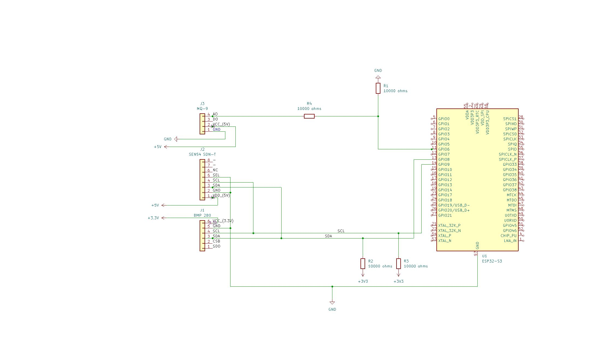

&#x20;

## Table of Contents

- [Introduction](#aqmod-aka-air-quality-module)
- [Prerequisites](#prerequisites)
- [Hardware Setup](#hardware-setup)
- [Software Installation](#software-installation)
- [Usage](#usage)
- [Project Structure](#project-structure)
- [Troubleshooting](#troubleshooting)
- [Contributing](#contributing)
- [License](#license)

---

# AQMod aka Air Quality Module

**This project is a system built on top of ESP32-S3 integrating BMP 280, MQ-9 and SEN54 SDN-T sensors to track air quality.**

### What does it track?

- Temperature
- Humidity
- Pressure
- Particulate Matter (<1µm)
- Particulate Matter (<2.5µm)
- Particulate Matter (<4µm)
- Particulate Matter (<10µm)
- Voc Index
- Methane
- Altitude

### How does it track it?

- MQ-9 is responsible for tracking methane.
- BMP 280 is responsible for tracking temperature, pressure and altitude.
- SEN 54 is responsible for tracking particulate matters, humidity, temperature and voc index.

---

## Prerequisites

**Hardware:**

- ESP32-S3 dev board
- BMP280 breakout board
- MQ-9 breakout board
- SEN54 SDN-T
- Breadboard & jumper wires
- Elegoo Power Spply module

**Software:**

- Arduino IDE (with ESP32-S3 support)
- Required libraries:
  - `Adafruit BMP280 Library`
  - `MQUnifiedsensor`
  - `Sensirion I2C SEN5X`
- 

> **All these libraries can be downloaded through Arduino IDE library manager.**

---

## Hardware Setup


---

## Software Installation

1. Clone the repo:
   ```bash
   git clone https://github.com/yourusername/AQMod.git
   cd AQMod
   ```
2. Install dependencies:
   - In Arduino IDE: Sketch → Include Library → Manage Libraries…
   - Search for and install the listed libraries above.
3. Open and upload the sketch:
   - Via Arduino IDE: open `main/main.ino` and select the ESP32-S3 board.
---

## Usage

1. Upload firmware to ESP32-S3.
2. Open serial monitor at `115200 baud`.
3. Observe output.
---

## Project Structure

**WORK IN PROGRESS....**
---

## Troubleshooting

**WORK IN PROGRESS....**
---

## Contributing

Please open issues or pull requests! To contribute:

1. Fork the repo.
2. Create a feature branch: `git checkout -b feature/your-feature`
3. Commit changes and push: `git push origin feature/your-feature`
4. Open a PR against `develop` branch.

---

## License

This project is licensed under the MIT License – see the [LICENSE](LICENSE) file for details.

---

*Developed by Daniil Nahliuk(@daniilnahl)*

